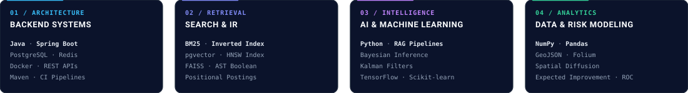
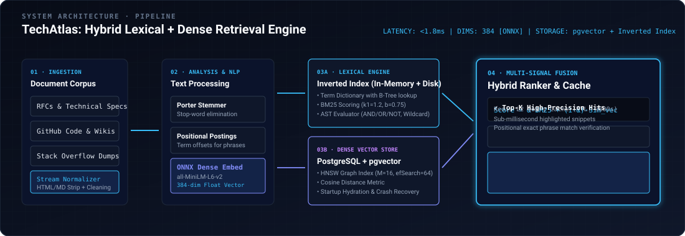
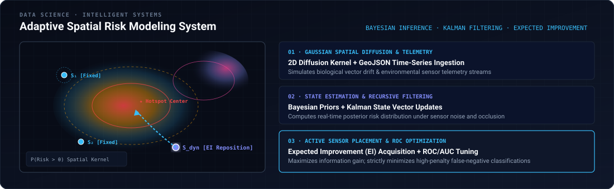
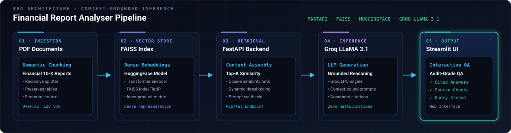
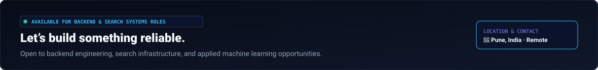

<!-- HERO BANNER (SELF-CONTAINED VECTOR ASSET) -->

  

<!-- REFINED DIRECT CTA LINKS WITH PROMINENT LIVE PORTFOLIO -->

  
  &nbsp;
  
  &nbsp;
  
  &nbsp;
  

---

### `01` — ENGINEERING DISCIPLINES

---

### `02` — FEATURED SYSTEMS

#### **1. TechAtlas — Engineering Knowledge Search Engine**
> **Java** · **Spring Boot** · **PostgreSQL + pgvector** · **Redis** · **Docker** · **BM25** · **HNSW**

A custom-engineered hybrid technical search engine designed to ingest, index, and query technical RFCs, GitHub repositories, and documentation.

* **Inverted Index Engine:** Persistent and in-memory inverted indices with tokenization, Porter stemming, stop-word elimination, and positional posting lists for precise phrase matching.
* **AST Query Processor:** Abstract Syntax Tree (AST) evaluator supporting Boolean operators (`AND`, `OR`, `NOT`), field-aware queries, wildcard searches, and synonym expansion.
* **Hybrid Lexical + Vector Retrieval:** Coupled deterministic BM25 ranking with 384-dimensional ONNX dense embeddings indexed via `pgvector` HNSW graphs.
* **Production Resiliency:** Background index hydration, automatic crash consistency repair routines, and Redis caching layers for efficient repeated query handling.

---

#### **2. Adaptive Spatial Risk Modeling System**
> **Python** · **NumPy** · **Pandas** · **GeoJSON** · **Bayesian Inference** · **Kalman Filtering** · **Folium**

An intelligent spatiotemporal risk localization platform developed at **Arsha Consultants** to model dynamic biological risk vectors and optimize IoT physical sensor deployments.

* **Spatiotemporal Diffusion Modeling:** Implemented 2D Gaussian spatial diffusion kernels simulating risk vector movement across geographic topologies.
* **Bayesian & Kalman Estimation:** Integrated Bayesian priors with recursive Kalman filter updates to dynamically track hotspot probability fields under noisy telemetry.
* **Active Optimization (Expected Improvement):** Formulated an Expected Improvement (EI) acquisition function to compute optimal relocation trajectories for mobile sensor nodes.
* **Cost-Sensitive Decision Boundaries:** Calibrated decision thresholds via ROC/AUC analysis to strictly minimize high-consequence false-negative predictions.

---

#### **3. RAG-Based Financial Report Analyser**
> **Python** · **FastAPI** · **FAISS** · **LangChain** · **HuggingFace** · **Groq LLaMA 3.1** · **Streamlit**

An automated retrieval-augmented intelligence system built to ingest multi-page financial disclosures and provide context-grounded answers.

* **Recursive Semantic Chunking:** Ingested PDF financial reports with recursive text chunking preserving tabular structures and footnote context.
* **Dense Vector Indexing:** Generated transformer embeddings via HuggingFace models and indexed them in FAISS for top-$k$ semantic retrieval.
* **FastAPI & LLM Orchestration:** Built a FastAPI backend pipeline feeding retrieved context into Groq-hosted LLaMA 3.1 for grounded question answering with Streamlit UI.

---

### `03` — TECHNICAL STACK

| Category | Primary Technologies & Tooling |
| :--- | :--- |
| **Languages** | `Java` `Python` `C++` `SQL` `Dart` |
| **Backend & Frameworks** | `Spring Boot` `Spring MVC` `FastAPI` `REST APIs` `Flutter` `Streamlit` |
| **Databases & Search** | `PostgreSQL` `pgvector (HNSW)` `Redis` `MongoDB` `FAISS` `BM25 Indexing` |
| **AI, Data & Modeling** | `NumPy` `Pandas` `Scikit-learn` `TensorFlow` `Bayesian Inference` `Kalman Filtering` |
| **DevOps & Engineering** | `Docker` `Git` `GitHub` `Maven` `JIRA` `GeoJSON` `Folium` `Matplotlib` `Figma` |

 

---

### `04` — EXPERIENCE & EDUCATION

| 💼 Experience | 🎓 Education & Credentials |
| :--- | :--- |
| **Risk Modeling Intern** — *Arsha Consultants* `Jan 2026 – Jun 2026` · Pune, India  • Architected adaptive spatiotemporal risk models using Bayesian inference &amp; Kalman filtering for dynamic anomaly localization. • Developed sensor optimization algorithms using Expected Improvement (EI) to maximize spatial coverage with minimal IoT nodes. • Evaluated model discrimination and cost-sensitive trade-offs via ROC/AUC curves. | **B.E. in Computer Engineering** *Marathwada Mitra Mandal's College of Engineering (MMCOE)* `2023 – 2027` · TY CGPA: **9.285 / 10.0**  **📜 Certifications** • **Intel Unnati Data-Centric Labs:** Emerging Tech / ML • **Flutter &amp; Dart:** The Complete Guide  **🤝 Leadership** • **Secretary:** IEEE Student Branch • **Marketing Member:** Google Developer Student Club |

---

### `05` — GITHUB ACTIVITY

<table border="0">
  <tr>
    <td align="center" width="50%">
      
    </td>
    <td align="center" width="50%">
      
    </td>
  </tr>
</table>

---

### `06` — CONNECT

  

&nbsp;&nbsp;

&nbsp;&nbsp;

&nbsp;&nbsp;

  

© 2026 Soham Hadap · Systems &amp; Search Engineering Profile

